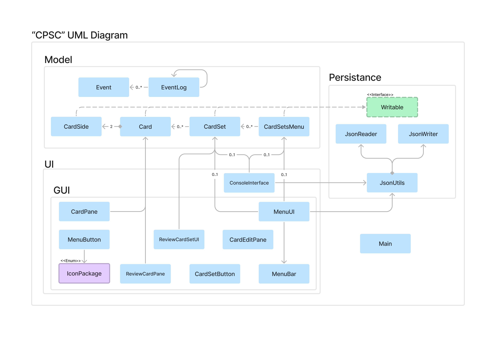

# CPSC (Computer Powered Study Cards)
As an average CS student, I'm sure you've had this moment:
### "Oh no, i have 100 words to remember for my latin quiz, what do i do?"
Well, let me introduce you to the one and only **CPSC**, a versatile study tool that **improves neural memory capacity** through **active memory recall** with an innovative **human-machine interface**, all powered by state-of-the-art **Object-Oriented Java Programming**. 
###### (It's a flashcard application)
## Description
Realistically speaking, CSPC is a **Java-based flashcard application**. A flashcard is a study tool that is used to aid memorization. In general, the front side of a flashcard consists of some question or term, and the reverse side is the answer. By creating a set of flashcards, the user can test and improve memory of terms and concepts. As such, this application will have the following functions:
1. Create flashcards (front and back) with image support 
   - Contains a text editor to edit text on flash cards.
2. Store and organize sets of created flashcards that **can be edited**
3. Use various study modes with the flashcards
   - A typical flashcard mode, where one side is revealed first.
   - A matching mode, where users need to match each front of a flashcard to its corresponding side
   - A language dictation mode for learning new language vocab (*this feature is not confirmed*)
4. Target difficult cards that are commonly incorrect in card sets and implement an algorithm to target those during various study modes.

## Target Audience
Anyone that want to use a free and open-source application to create flashcards. Any one learning a new language will benefit from this application to study and learn new vocabulary. Likewise, biology students can utilize this application to memorize the 50 million vocabs they need to remember every unit. In general, CPSC is for anyone who needs a flashcard based memory aid!

## Rationale
As I started taking a biology course, I realized how I needed a tool to help me memorize the various vocabulary that I encounter during my readings. Unhappy with the various online options, I decided wanted to make my own version of a flashcard app. I thought this would be a great opportunity to build an application custom to my needs. Moreover, the nature of the application can help me develop skills of building better user interfaces. 

## User Stories

### User Story (P0)

- As a user, I want to create cards and store them in a list of flashcards (cardset)
- As a user, I want to store and organize sets of flashcards
- As a user, I want to be able to edit individual cards and sets
- As a user, I want to have various study modes that help me use the cards
- As a user, I want an interface to see the sets of cards, and the cards in each set

### User Story (P1)
- As a user, I want to create cards and store them in a list of flashcards (cardSet)
- As a user, I want to be able to edit individual cards and sets
- As a user, I want to be able to delete individual cards and sets
- As a user, I want to use each flashcard set to study (the order will be randomized)
- As a user, I want an UI interface to see the sets of cards, and the cards in each set
  - Cardsets should be stored in a menu that contains a list of other cardSets
  - Cardsets should be visible in a select menu, with the most used cardSet at the top (based on use count)
### User Story (P2)
- As a user, I want to have the option to save the entire state of the program (option to save the main menu and each cardSet after any changes are made)
- As a user, I want to have the option to load ALL the data into the CardSetMenu (all cardSets are loaded) or each cardSet is loaded upon selection
- As a user, I want to have the option to delete CardSet data

### User Story (P3)
- As a user, I want to be able to create cardsets and store them in the cardsetmenu
- As a user, I want to be able to create cards and store them in a cardset
- As a user, I want the most used cardSet displayed first (sort the list of cardSets)
- As a user, I want to be able to delete cards or cardsets

### Instructions for Grader
- To create a new CardSet, press the new file button at the top left. Confirm the action by pressing the save button on the top left.
- To create a new Card, select a cardSet from the main menu and press the add card button. Then confirm action with the add card icon and the process is complete.
- To delete a cardSet, select it and press the "trash" button. To delete a card, select a card and press the same "trash" button.
- A custom logo should be visible as the program starts and all buttons within the program also has custom icons
- To save, simply press the button with the save icon at the top left of the program
- To load, press the "Load Data" button that is prompted when the program first loads, or press the button with the download icon. To load a specific cardset, just select the cardset from the menu.

### Phase 4: Task 2
Creating a new CardSet
```
Sat Apr 01 19:59:04 PDT 2023
CardSet 'test card set' has been added.
```
Creating a new Card
```
Sat Apr 01 20:07:06 PDT 2023
New Card 'model.Card@1722ad08' added to CardSet 'test card set'
```
Deleting a CardSet
``` 
Sat Apr 01 20:02:01 PDT 2023
CardSet 'test card set' has been removed.
```
Deleting a Card
```
Sat Apr 01 20:01:39 PDT 2023
Card 0 has been deleted
```
Loading data, creating new cardSet, adding new card in cardSet, deleting the new card, deleting the cardset
```
Sat Apr 01 20:19:03 PDT 2023
CardSet 'new cardset' has been added.
Sat Apr 01 20:19:11 PDT 2023
New Card 'model.Card@21040bb' added to CardSet 'new cardset'
Sat Apr 01 20:19:14 PDT 2023
Card 0 has been deleted
Sat Apr 01 20:19:16 PDT 2023
CardSet 'new cardset' has been removed.

Process finished with exit code 0
```

### Phase 4: Task 3

A big issue I have is the lack of cohesion in my main UI class. Instead of a huge `MenuUI` class, I can refactor much of the code to have a class for each main frame, much like what i did with `ReviewCardSetUI`.
There also is some code duplication within the style classes in the UI, this can be fixed by adding suitable class inheritance in the right place. One other thing is that instead of passing through a reference to the same instance of `CardSetMenu` and `CardSet` it _could_ (maybe) be beneficial to implement an observer pattern to decouple the interactions between the model and the UI. 

In terms of the model, the classes `CardSetMenu` and `CardSet` can implement the `Iterable` interface. This makes more sense because both are essentially a collection of items that can be iterated through. This approach would be cleaner than the current approach of having a getter for the list of elements within each class.
The `JsonUtils` should be a utility class with only static methods. However, it was made a concreate class under the assumption that there could be there need for different saving actions for different paths. This makes the use of `JsonUtils` less clean than I would've liked. It is possible to refactor the functions to contain the file path which should remove the need for instantiation.